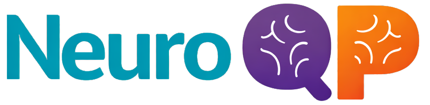

---
hide:
  - navigation
  - toc
---

<div class="nqp-hero">
  <div class="nqp-hero__copy">
    <h1>Build your own NeuroQP analyses in Python.</h1>
    <p class="nqp-hero__lead">Open a NeuroQP project export, navigate animals, slices, stainings, and atlas registrations, then work directly with classification and cell-match results as NumPy arrays.</p>
    <div class="nqp-hero__actions">
      <a href="getting-started/quickstart/" class="md-button md-button--primary">Quickstart</a>
      <a href="reference/functions/" class="md-button">Browse the API</a>
    </div>
  </div>
  <div class="nqp-hero__mark" aria-hidden="true">
    
  </div>
</div>

```python
from neuroqp import open_export

with open_export("neuroqp_export.zip") as export:
    print(export)
    print(export.animals[0].slices)
```

NeuroQP Python treats export files as untrusted input. Metadata is validated when an export opens; large NumPy result files are loaded only when requested.

<div class="nqp-paths">
  <div>
    <h2>Start with real data</h2>
    <p>Install the package and open a ZIP archive or extracted directory.</p>
    <a href="getting-started/installation/">Installation →</a>
  </div>
  <div>
    <h2>Understand the objects</h2>
    <p>Move from a project to animals, slices, images, and optional results.</p>
    <a href="concepts/object-model/">Object model →</a>
  </div>
  <div>
    <h2>Check the wire format</h2>
    <p>Read the normative contract for every supported export version.</p>
    <a href="specifications/">Export specifications →</a>
  </div>
</div>

!!! note "Release status"
    `0.1.0.dev0` is an unpublished release candidate. Install it from a source checkout until the first PyPI release.
